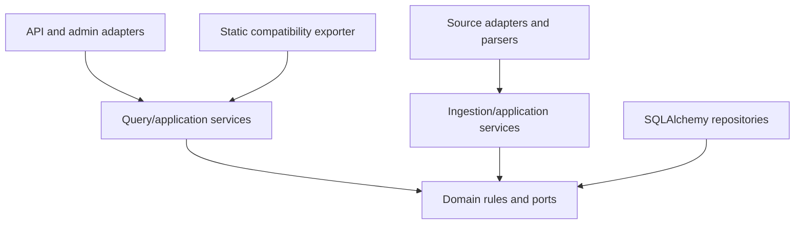

# WATCHDOG V4 architecture

Status: **Proposed** for P1.1 review in issue [#6](https://github.com/IgnacioR04/WatchDogs/issues/6).

Evidence base: `main` merge `4bdb8ee` on 2026-08-09, plus the P0 [current-state](CURRENT_STATE.md), [public-contract](PUBLIC_CONTRACT.md), [test-baseline](TEST_BASELINE.md), and [risk-register](RISK_REGISTER.md) inventories. This document defines the target boundaries; it does not claim that the database or V4 runtime exists yet.

## Scope and goals

V4 incrementally adds a person-centric, provenance-preserving data platform around the working batch pipeline. The architecture must:

- make PostgreSQL the eventual source of truth for V4 queries;
- represent people, organizations, securities, source documents, events, coverage, and ingestion runs explicitly;
- keep ingestion and query execution separate;
- preserve `event_date`, `known_date`, `scrape_date`, and anti-lookahead behavior;
- make incomplete, failed, unavailable, and inapplicable coverage observable;
- keep current static files, URLs, pipeline entry points, dashboard, and intelligence consumers working until a later compatibility gate permits a switch;
- prevent name similarity from silently combining different people.

P1.1 does not introduce a database, dependencies, API, worker, migration, exporter, or runtime behavior. Those changes remain owned by later work packages.

## System boundaries

| Boundary | Owns | Must not own |
|---|---|---|
| Source adapters | Provider-specific discovery, HTTP fetch, rate etiquette, and raw response metadata | Canonical identity decisions, API responses, or direct static publication |
| Parsers/normalizers | Reproducible conversion of a source artifact into typed DTOs and parse diagnostics | Database transactions, UI logic, or unsupported inference |
| Entity resolution | Candidate generation, evidence scoring, ambiguity, and audited manual decisions | Provider fetching, persistence details, or fuzzy auto-merge |
| Ingestion services | Run lifecycle, transaction policy, idempotent persistence, coverage updates, and retries | Serving user reads or shaping dashboard JSON |
| Domain | Entity meaning, temporal and provenance invariants, and repository ports | FastAPI, SQLAlchemy mappings, HTTP clients, or file paths |
| Persistence adapters | SQLAlchemy 2 mappings, repository implementations, SQL constraints, and units of work | Source fetching or presentation policy |
| Query services/API | Read models, filters, authorization boundaries, and cursor pagination | Live provider calls, parser execution, or writes during ordinary reads |
| Static exporter | Deterministic compatibility projections from canonical reads | Canonical storage, ingestion, or new business semantics |
| Legacy pipeline/consumers | Existing `run_all.py`, `run_pipeline.py`, `data/public/*`, dashboard, and intelligence behavior during migration | Defining the V4 database truth |

## Dependency direction

Dependencies point toward domain policy and explicit ports. Framework and provider code remain replaceable adapters.



The practical import rules are:

1. domain types and repository interfaces import no FastAPI, SQLAlchemy, scraper, dashboard, or exporter modules;
2. application services depend on domain types and repository/unit-of-work ports;
3. SQLAlchemy models and repository implementations satisfy persistence ports and do not escape into API schemas or parser DTOs;
4. source adapters emit typed normalized DTOs; an ingestion service resolves identity and persists them;
5. routes call query/application services, never ORM sessions or current JSON files directly;
6. the exporter calls a stable query/export interface, not tables or source adapters directly;
7. legacy code remains outside these new boundaries until a separately reviewed migration moves it.

See [ADR-0004](adr/ADR-0004-repository-service-separation.md).

## Execution paths

### Existing path during additive migration

```text
external providers -> current scrapers -> current normalization/derivation
                   -> data/public/* -> dashboard/intelligence/static clients
```

This path remains operational until explicit later gates prove its replacement. P1.1 changes none of it.

### Target ingestion path

```text
scheduled/manual trigger -> source adapter -> source document metadata
                         -> parser/DTO -> identity resolution
                         -> ingestion service/repositories -> PostgreSQL
                         -> coverage + ingestion-run result
```

### Target read and export paths

```text
client -> FastAPI /v1 -> query service/repository -> PostgreSQL

scheduled export -> export query interface -> PostgreSQL
                 -> atomic data/public/* snapshot -> legacy consumers
```

An ordinary read never calls an external provider. A refresh is an authenticated, explicit ingestion action with its own run identifier; queue/worker topology is deferred until workload evidence justifies it. Redis is not part of P1 by default. See [ADR-0005](adr/ADR-0005-read-ingestion-separation.md).

## Source of truth and dual-run transition

The phrase “source of truth” is phase-specific during migration:

| Stage | V4 query truth | Legacy consumer truth | Required evidence before advancing |
|---|---|---|---|
| Current/P1 | Not available | Current generated JSON pipeline | P0 baseline remains green |
| Additive persistence | PostgreSQL for verification only; no public cutover | Current generated JSON pipeline | Migrations, constraints, idempotency, and connector reconciliation |
| V4 API activation | PostgreSQL | Current JSON for unchanged consumers | API/coverage/provenance and rollback tests |
| Exporter dual-run | PostgreSQL | Existing files until projections compare cleanly | Shape, count, semantic, freshness, and lineage reconciliation |
| Exporter cutover | PostgreSQL | JSON generated from PostgreSQL | P8 compatibility approval and repeatable rollback |
| Legacy cleanup | PostgreSQL | Only explicitly retained exports | Stable observation period and evidence of no dependent consumer |

During dual-run, a discrepancy is recorded and investigated; neither side silently overwrites the other as “correct.” Reconciliation must classify mapping differences, duplicates, unresolved identities, partial coverage, and time-window differences. Static output is not used to reconstruct canonical state. See [ADR-0001](adr/ADR-0001-postgresql-source-of-truth.md) and [ADR-0006](adr/ADR-0006-static-json-compatibility-exporter.md).

## Canonical identity and domain relationships

- A canonical `Person` has an immutable UUID. Names, aliases, provider identifiers, wallet addresses, tickers, and source strings are attributes or external identities, not primary identity.
- Organizations and securities have their own canonical UUIDs. A ticker is nullable and mutable; it is not a security identity.
- A source record can remain persisted with unresolved or ambiguous person linkage. Lack of a safe match must not cause source-data loss.
- A prediction market *about* a person is distinct from a wallet/trader controlled by that person. Campaign-finance activity related to a candidate is distinct from personal holdings or trading.
- Canonical merges are explicit, auditable operations. Candidate similarity alone never performs a merge.

See [ADR-0003](adr/ADR-0003-uuid-canonical-person-identity.md) and [ADR-0010](adr/ADR-0010-entity-resolution-no-auto-merge.md).

## Event and specialized-record model

`events` is the common, time-addressable envelope for facts such as a transaction, filing, disclosure, news mention, or prediction-market observation. It carries shared links, temporal fields, source identity, confidence, and lifecycle timestamps. A typed table carries the fields that make the fact meaningful: trade code and quantities, holding snapshot values, filing ownership percentages, campaign-finance roles, news attributes, or market subject/trader relationships.

The intended relation is one event to zero or one row of the relevant specialization, enforced by foreign keys and type constraints. Source documents, people, aliases, roles, organizations, securities, coverage, and ingestion runs are separate first-class records rather than event subtypes. JSONB is reserved for provider extensions or not-yet-promoted fields, not for avoiding relational design.

Unresolved identity links may be nullable when source evidence is insufficient; provenance and a stable source-natural key remain mandatory. See [ADR-0008](adr/ADR-0008-event-specialized-table-design.md).

## Temporal invariants

The existing temporal vocabulary remains authoritative:

| Field | Meaning |
|---|---|
| `event_date` | When the underlying fact or reporting period occurred |
| `known_date` | Earliest supported date when that fact was publicly knowable |
| `scrape_date` | When WATCHDOG acquired the source record |
| `delay_days` | Calendar-day difference between `known_date` and `event_date` |
| `fetched_at` | Timezone-aware UTC timestamp for a particular source fetch |

Required invariants:

1. `known_date >= event_date`; violations are rejected or quarantined, never silently used in analysis.
2. `delay_days` is derived from the two dates and cannot disagree with them.
3. An as-of query or model may consume a record only when `known_date <= as_of`.
4. `scrape_date` and `fetched_at` never substitute for an unknown event or public-known date.
5. `known_date = event_date` is allowed only when the provider semantics support immediate public knowledge, not as a generic missing-data fallback.
6. If required event dates cannot be supported, the source document and parse diagnostics remain persisted without inventing an event.
7. Corrections retain source-document lineage and ingestion timestamps; mutable arrival time is never part of a deduplication key.

These rules preserve the anti-lookahead intent already implemented in `normalize/schema.py` while moving enforcement toward typed models, service validation, database constraints where practical, and data-quality tests.

## Provenance and idempotency

Every externally derived canonical record identifies its provider/source and stable source record key. When a retrievable document or API payload exists, the record links to immutable fetch/document metadata including URL when available, fetch time, content hash when possible, parser version, parse status, and error/OCR state. Provider limitations may prevent raw-content retention, but never justify omitting the fetch metadata and limitation reason.

Uniqueness is based on provider-natural identifiers and stable relationships, with database constraints as the final guard. UUIDs, scrape timestamps, mutable display names, and list position are not deduplication keys. Repeated ingestion must update or no-op deterministically and report inserted, updated, duplicate, and failed counts. See [ADR-0009](adr/ADR-0009-provenance-source-documents.md).

## Failure and coverage semantics

Absence of returned facts is not a single state:

| Coverage status | Meaning |
|---|---|
| `available` | Applicable source checked successfully and supported records were found |
| `no_records` | Applicable scope checked successfully and no supported records were found |
| `not_applicable` | The source does not apply to this entity/scope based on recorded evidence |
| `not_checked` | No completed check exists for this entity/scope |
| `partial` | Some scope was checked, but a cap, checkpoint, parser limitation, or other gap prevents completeness |
| `stale` | Prior usable coverage exists but its freshness policy has expired |
| `source_error` | The provider/fetch prevented a reliable check |

Coverage always includes source, scope, last check/success, record count, covered range, completeness, and any error/partial reason. “No records” is emitted only after a successful applicable check; a provider failure or parser failure cannot be translated to `no_records`.

Ingestion runs separately record lifecycle and counts. A document-level parse failure persists document metadata, `parse_status`, error, and `requires_ocr` where relevant, then marks the run/coverage partial or failed according to the documented connector transaction policy. A configured preview cap is valid only when labeled preview/partial; complete mode paginates to exhaustion or records why it did not.

## Query and pagination semantics

Large chronological collections use opaque cursor/keyset pagination, not offset pagination. The stable order is `known_date DESC, event_date DESC, id DESC`, and the cursor carries a version, snapshot boundary, filter fingerprint, and last sort tuple. Later pages reuse the normalized filters and exclude records created after the first-page snapshot. Invalid, mismatched, or stale cursor versions return a client error instead of silently changing meaning. See [ADR-0007](adr/ADR-0007-cursor-pagination.md).

## Compatibility and rollback boundary

- Current commands, workflows, public paths, and JSON shapes remain unchanged by P1.1.
- New storage and read paths are additive until their phase gates pass.
- Consumer cutovers are independently reversible; disabling V4 API routing or the DB-backed exporter restores the previous consumer path without deleting canonical data.
- Database recovery uses reviewed Alembic migrations, forward fixes where safer, tested backups/restores, and documented cutover checkpoints. A lossy downgrade is never the only rollback plan.
- Generated JSON is a projection and cache, not a database backup.

## ADR map

| ADR | Decision | Status |
|---|---|---|
| [ADR-0001](adr/ADR-0001-postgresql-source-of-truth.md) | PostgreSQL source of truth | Proposed |
| [ADR-0002](adr/ADR-0002-sqlalchemy-2-and-alembic.md) | SQLAlchemy 2 and Alembic | Proposed |
| [ADR-0003](adr/ADR-0003-uuid-canonical-person-identity.md) | UUID canonical, person-centric identity | Proposed |
| [ADR-0004](adr/ADR-0004-repository-service-separation.md) | Repository/service separation | Proposed |
| [ADR-0005](adr/ADR-0005-read-ingestion-separation.md) | Read and ingestion separation | Proposed |
| [ADR-0006](adr/ADR-0006-static-json-compatibility-exporter.md) | Static JSON compatibility exporter | Proposed |
| [ADR-0007](adr/ADR-0007-cursor-pagination.md) | Cursor/keyset pagination | Proposed |
| [ADR-0008](adr/ADR-0008-event-specialized-table-design.md) | Event envelope plus specialized tables | Proposed |
| [ADR-0009](adr/ADR-0009-provenance-source-documents.md) | Provenance and source-document requirements | Proposed |
| [ADR-0010](adr/ADR-0010-entity-resolution-no-auto-merge.md) | No automatic entity merge | Proposed |

All ADRs remain **Proposed** until independent architecture and QA/documentation review records acceptance. Their presence must not be read as P1 approval or as evidence that runtime implementation is complete.
